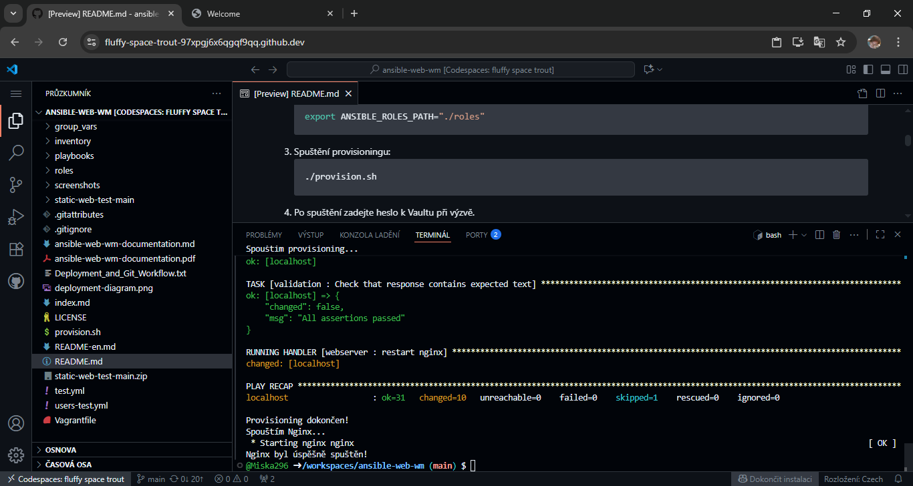

# Ansible Web Server Deployment


Automatizované nasazení a zabezpečení webového serveru pomocí Ansible v prostředí GitHub Codespace. Projekt zahrnuje konfiguraci SSH, firewallu, aktualizací systému, nasazení statického webu a validaci funkčnosti.
> Tento projekt je dostupný také v anglické verzi: [README-en.md](README-en.md)

---
---
# Úvodní část
## 1. Informace o projektu
Tento projekt slouží k automatizované instalaci a konfiguraci webového serveru pomocí Ansible. Obsahuje:
- Role pro Nginx, Fail2ban, firewall, SSH a automatické aktualizace
- Použití `ansible-vault` pro bezpečné uchování hesel
- Playbooky a skript `provision.sh` pro snadné nasazení 

Projekt vychází z [static-web-test](https://github.com/Miska296/static-web-test), vytvořeného v prostředí Replit, a byl výrazně rozšířen o bezpečnostní prvky, automatizaci a systémovou správu.
**Projekt byl plně otestován — provisioning proběhl bez chyb, všechny služby byly úspěšně ověřeny.**


---
## 2. Projekt: Ansible Web Server `ansible-web-wm`
Komplexní automatizace Linux serveru pomocí **Ansible**, zaměřená na:
- bezpečnostní konfiguraci (`firewall`, `fail2ban`, `ssh`)
- automatické aktualizace systému
- vytvoření dedikovaného uživatele `webapp`
- nasazení jednoduchého webserveru
- použití `ansible-vault` pro šifrování citlivých údajů

---
## 3. Požadavky na prostředí
- Python 3.8+
- Ansible 2.10+
- Linux server nebo VM s SSH přístupem
- Vault heslo pro šifrované proměnné
- Správně nastavený soubor `inventory/hosts.ini`
- Nainstalovaný `sudo` (pro běh s `become: true`)

---
---
# Nasazení a konfigurace
## 4. Struktura projektu
kořenová složka `ansible-web-wm/`:
- inventory/hosts.ini      *(Definice cílového hostitele)*  

- playbooks/webserver.yml  *(Hlavní playbook)*

- roles/users              *(Vytváření uživatelů)*
- roles/ssh                *(Konfigurace SSH)*
- roles/firewall           *(UFW + fail2ban)*
- roles/updates            *(Systémové aktualizace)*
- roles/webserver          *(Instalace a konfigurace NGINX)*
- roles/validation         *(Ověření funkčnosti webu)*
- group_vars/web/vault     *(Hesla a proměnné chráněné Vaultem)*

- provision.sh
- README.md


*Struktura projektu v Codespace*

---
## 5. Spuštění projektu
1. **Volitelné: Klonování repozitáře**  
   Pokud ještě nemáte repozitář stažený:
   ```bash
   git clone https://github.com/Miska296/ansible-web-wm.git
   cd ansible-web-wm
   ```
2. Nastavení cest k rolím (v provision.sh už připraveno):
   ```bash
   export ANSIBLE_ROLES_PATH="./roles"
   ```
3. Spuštění provisioningu:
   ```bash
   ./provision.sh
   ```
4. Po spuštění zadejte heslo k Vaultu při výzvě.
5. Ověřte, že NGINX běží:
    ```bash
    curl http://localhost
    ```
6. Otevřete veřejnou URL (např. v Codespace): https://fluffy-space-trout-97xpgj6x6qgqf9qq-80.app.github.dev
7. Ověřte funkčnost webserveru:  
Otevřete v prohlížeči `http://localhost` nebo veřejnou URL — měla by se zobrazit stránka s následujícím obsahem:
   ```html
   <h1>Hello from Ansible-managed NGINX!</h1>
   <p>Server configured automatically by michaela using Ansible</p>
   ```
*Tento text musí být obsažen ve výstupu, aby validace proběhla úspěšně.*

---
## 6. Ansible Vault – Bezpečné uchování hesla
- Citlivé heslo bylo zašifrováno pomocí `ansible-vault`:
   ```bash
   ansible-vault encrypt group_vars/web/vault
   ```
- Proměnná:
   ```yaml
   webapp_password: "tajneheslo123"
   ```
- Použita v roli `users`:
   ```yaml
   - name: Create dedicated user webapp with password from Vault
   user:
      name: webapp
      password: "{{ webapp_password | password_hash('sha512') }}"
      shell: /bin/bash
      state: present
   ```
- Vault je výslovně načten v playbooku:
   ```yaml
   vars_files:
   - ../group_vars/web/vault
   ```

---
## 7. Další bezpečnostní prvky
- SSH zabezpečení:
   - Zakázáno root přihlášení (`PermitRootLogin no`)
   - Zakázáno heslové přihlášení (`PasswordAuthentication no`)
   - Ansible spravuje `sshd_config` s `--force-confold` pro bezpečné aktualizace

- Firewall (UFW) chrání server a povoluje pouze nezbytné porty:
   - Povolené porty: `22/tcp`, `80/tcp` (včetně IPv6)
   - Stav ověříte příkazem:
      ```bash
      sudo ufw status
      ```

- Fail2ban je nainstalován a aktivován:
   - Automatická ochrana proti `brute-force` útokům
      ```yaml
      - name: Enable fail2ban service
      service:
         name: fail2ban
         enabled: true
      ```

---
## 8. Webový server
- NGINX:
   - Instalace přes `apt`
   - Konfigurace pomocí šablony `nginx.conf.j2`
   - Root adresář: `/opt/static-sites`
   - Obsah generován ze šablony `index.html.j2`:
      ```html
      <h1>Hello from Ansible-managed NGINX!</h1>
      <p>Server configured automatically by michaela using Ansible</p>
      ```

- Git deploy (volitelně):
   - Repozitář: `static-web-test`
   - Klonuje se do `/opt/static-sites`
   - Přepis `index.html` z šablony zajišťuje validaci

---
---
# Ověření a testování
## 9. Validace funkčnosti
Role `validation` ověřuje, že webový server odpovídá správně. Na konci hlavního playbooku se provádí HTTP test pomocí modulu `uri`, který ověřuje, zda stránka obsahuje očekávaný text:
  
   ```yaml  
    - name: Validate web server response  
      uri:  
         url: http://localhost  
         return_content: yes  
      register: web_response  

    - name: Check that response contains expected text
      assert:
         that:
         - "'Hello from Ansible-managed NGINX!' in web_response.content"
   ```

---
## 10. Testování a ověření funkčnosti
Po dokončení provisioning proveďte následující kontroly:
- **Webserver běží:**
   ```bash
   systemctl status nginx
   ```
- Porty otevřené:
   ```bash
   ss -tuln | grep :80
   ```
- Firewall neblokuje komunikaci:
   ```bash
   ufw status
   ```
- Fail2ban chrání server:
   ```bash
   fail2ban-client status
   ```
- Ansible playbook proběhl bez chyb:  
Sledujte výstup v terminálu – `failed=0` potvrzuje úspěch


*Úspěšné dokončení provisioning (`failed=0`)*

Webová stránka byla úspěšně nasazena a je dostupná na veřejné adrese v GitHub Codespace:  
[fluffy-space-trout-97xpgj6x6qgqf9qq-80.app.github.dev](https://fluffy-space-trout-97xpgj6x6qgqf9qq-80.app.github.dev/)

> **Upozornění:** Veřejná URL funguje až po úspěšném provisioning a zveřejnění portu 80 v Codespace.


*Zobrazená stránka po nasazení NGINX*

---
## 11. Řešení problémů
Tato sekce obsahuje nejčastější chyby, které mohou nastat při nasazení projektu, a jejich řešení. Doporučuji ji projít, pokud provisioning proběhl bez chyb, ale výsledek není podle očekávání.

### 1. Žádný port nebyl otevřen
Pokud po provisioning nejsou otevřené porty 22 (SSH) nebo 80 (HTTP), zkontrolujte následující:
1. **Firewall (UFW)**  
   Ověřte stav firewallu:
   ```bash
   sudo ufw status
   ```
- Pokud je aktivní, povolte potřebné porty:
   ```bash
   sudo ufw allow 22
   sudo ufw allow 80
   sudo ufw reload
   ```

### 2. Porty nejsou dostupné v Codespace
Pokud nejsou porty 22 nebo 80 viditelné v záložce „Ports“:
1. Otevřete záložku **Ports** v Codespace
2. Klikněte na **„Add port“**
3. Zadejte `80` a zaškrtněte **„Public“**
4. Po uložení se zobrazí veřejná URL, např.  
`https://fluffy-space-trout-97xpgj6x6qgqf9qq-80.app.github.dev/`  
> *Poznámka: URL se generuje automaticky podle názvu Codespace. Váš odkaz bude mít jiný tvar.*
5. Otevřete ji v prohlížeči a ověřte, že se stránka načte
6. Ověřte, že NGINX naslouchá na všech rozhraních (`listen 80`, `listen [::]:80`)

### 3. NGINX běží, ale není dostupný
   Ověřte stav služby:
   ```bash
   systemctl status nginx
   ```
   Zkontrolujte, zda naslouchá na portu 80:
   ```bash
   ss -tuln | grep :80
   ```

### 4. SSH přístup omezený
Pokud jste zakázali přihlášení pomocí hesla nebo root uživatele, ujistěte se, že máte správně nastavený SSH klíč v `sshd_config`.

### 5. Provisioning proběhl, ale změny se neprojevily
   Zkuste provisioning spustit znovu:
   ```bash
   ./provision.sh
   ```

### 6. Web není dostupný zvenčí
Pokud se webová stránka nezobrazuje přes veřejnou URL (např. v Codespace), zkontrolujte:
1. **Konfiguraci NGINX**
   - Ujistěte se, že v šabloně `nginx.conf.j2` je:
     ```nginx
     server_name _;
     listen 80;
     listen [::]:80;
     ```
   - Tím zajistíte, že server naslouchá na všech rozhraních a není omezen na `localhost`.
2. **Restart služby**
   - V prostředí bez `systemd` použijte:
     ```bash
     service nginx restart
     ```
3. **Zveřejnění portu**
   - V Codespace ručně přidejte port `80` v záložce „Ports“ a nastavte ho jako „Public“.
4. **Firewall**
   - Ověřte, že porty `22` a `80` jsou povolené:
     ```bash
     sudo ufw status
     ```

---
## 12. Stav projektu
- **Správa uživatelů** — Ano
- **Vault pro hesla** — Ano
- **Zabezpečení (SSH, firewall, Fail2ban)** — Ano
- **Automatické aktualizace systému** — Ano
- **Webserver (NGINX + Git deploy)** — Ano
- **Validace funkčnosti** — Ano
- **Provisioning skript** — Ano, bez chyb
- **Nasazení přes Vagrant** — Ano

> **Živá ukázka:** [Zobrazit projekt na GitHub Pages](https://miska296.github.io/ansible-web-wm/)

---
---
# Rozšíření a dokumentace
## 13. Bonusové funkce
Projekt obsahuje několik pokročilých funkcí, které zvyšují bezpečnost, spolehlivost a přehlednost nasazení:

- Automatické bezpečnostní aktualizace:
   ```yaml
   - name: Enable automatic security updates
     copy:
       dest: /etc/apt/apt.conf.d/20auto-upgrades
   ```
- Webová aplikace dostupná na portu `80`
- Uživatel `webapp` vytvořen pomocí hesla z Vaultu
- Ansible Vault: chrání citlivé proměnné (např. hesla)
- Idempotence: opakované spuštění playbooku nezpůsobí chyby
- Handlers: restart služeb pouze při změně konfigurace
- Debug výpisy: pro ladění obsahu `index.html` a odpovědi serveru

---
## 14. Nasazení přes Vagrant
### 14.1 Alternativní nasazení: Vagrant
Projekt lze spustit i lokálně pomocí Vagrantu, což umožňuje testovat provisioning v izolovaném prostředí.
> Soubor `Vagrantfile` je již součástí projektu a připraven k použití.  

⚠️ Vagrant nelze spustit v GitHub Codespace. Pro testování použij lokální počítač s nainstalovaným Vagrantem a VirtualBoxem.

- Požadavky:
   - Vagrant
   - VirtualBox nebo jiný poskytovatel VM

- Struktura:  
V kořenovém adresáři projektu se nachází soubor `Vagrantfile`, který definuje virtuální stroj:
    ```ruby
    Vagrant.configure("2") do |config|
        config.vm.box = "ubuntu/jammy64"
        config.vm.network "private_network", ip: "192.168.56.10"
        config.vm.provision "shell", path: "./provision.sh"
    end
    ```

- Spuštění:
   1. Inicializuj a spusť VM:
      ```bash
      vagrant up
      ```
   2. Připoj se k VM:
      ```bash
      vagrant ssh
      ```
   3. Ověř webový server:
      ```bash
      curl http://localhost
      ```
      Nebo z hostitelského systému:  
      ```bash  
      curl http://192.168.56.10  
      ```  
   4. Zastavení VM:  
      ```bash
      vagrant halt
      ```  
   5. Smazání VM (volitelně):  
      ```bash
      vagrant destroy
      ```

- Poznámka:  
Vagrant automaticky spouští `provision.sh`, takže není nutné ho spouštět ručně. Výhodou je, že prostředí je čisté a opakovatelné — ideální pro testování idempotence Ansible playbooku.

---
### 14.2 Další informace o testování nasazení přes Vagrant:
Testování provisioning procesu proběhlo také v samostatném repozitáři [vagrant-nginx-provisioning](https://github.com/Miska296/vagrant-nginx-provisioning), kde byly provedeny drobné úpravy souborů a kódu pro správné fungování v prostředí Vagrant. Tento repozitář slouží jako izolované testovací prostředí, které umožňuje ověřit funkčnost playbooku bez ovlivnění hlavního projektu `ansible-web-wm`.

Provisioning byl následně ověřen i v GitHub Codespace po instalaci Ansible, čímž byla potvrzena kompatibilita obou prostředí.

---
## 15. Osvědčené postupy
Doporučení pro správu projektu, konfiguraci služeb a udržení čisté struktury:

- Používejte `DEBIAN_FRONTEND=noninteractive` pro potlačení interaktivních dotazů při instalaci balíčků.
- Využívejte `ansible-vault` pro bezpečné uchování citlivých údajů.
- Po každém provisioning ověřte stav služeb (`nginx`, `fail2ban`, `ssh`) a otevřené porty.
- Používejte `server_name _` v konfiguraci NGINX, pokud chcete, aby server reagoval na požadavky z libovolné domény nebo IP adresy. → `server_name localhost` omezuje přístup pouze na místní stroj, což může blokovat přístup v prostředích jako Codespaces nebo při testování zvenčí.
- Přidejte `listen [::]:80;` pro podporu IPv6, což zvyšuje dostupnost v moderních sítích.
- Po každé změně konfigurace NGINX spusťte provisioning znovu a ověřte stav služby.
- Dokumentujte strukturu projektu, diagram nasazení a výstupy provisioning.
- Udržujte čistou strukturu repozitáře — vyhněte se zanořeným složkám.

---
## 16. Budoucí vylepšení
- Přidání automatizovaného testování pomocí GitHub Actions
- Vytvoření dynamického webového rozhraní pro provisioning
- Přidání podpory pro nasazení na bázi Dockeru
- Implementování logování a monitorování (např. Prometheus, Grafana)
- Přeložení dokumentace do dalších jazyků
> Tato sekce slouží jako roadmapa pro další vývoj projektu.

---
---
# Kontext a závěr
## 17. Související projekt
Tento projekt vychází z původního repozitáře [static-web-test](https://github.com/Miska296/static-web-test), kde byla vytvořena statická webová aplikace pomocí platformy Replit.
V projektu `ansible-web-wm` byla doplněna automatizace, bezpečnostní prvky a rozsáhlé testování.

---
## 18. Video prezentace projektu
Ukazuje kompletní běh skriptu `provision.sh`, nasazení webového serveru pomocí Ansible a ověření funkčnosti.

[](https://www.youtube.com/watch?v=aNvzjHr_p9I&t=3s)

---
## 19. Autor
Projekt vypracovala [Michaela Kučerová](https://github.com/Miska296)  
**Verze:** 1.0  
**Datum:** červenec 2025  
**Poslední aktualizace:** September 2025  
**Build:** OK

---
## 20. Licence
Tento projekt je dostupný pod licencí MIT. Podrobnosti viz soubor [LICENSE](LICENSE).