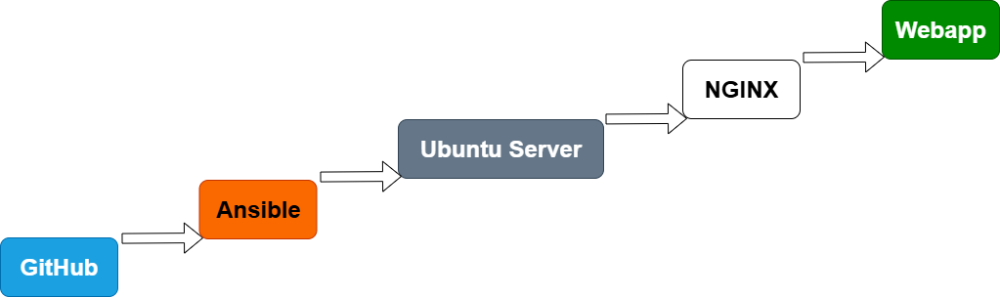

# ansible-web-wm
Automatizované nasazení a zabezpečení webového serveru pomocí Ansible
- Tento projekt je dostupný také v anglické verzi: [README-en.md](README-en.md)

---
## Informace o projektu
Tento projekt slouží k automatizované instalaci a konfiguraci webového serveru pomocí Ansible. Obsahuje:
- Role pro Nginx, Fail2ban, firewall, SSH a automatické aktualizace
- Použití `ansible-vault` pro bezpečné uchování hesel
- Playbooky a skript `provision.sh` pro snadné nasazení
Projekt vychází z [static-web-test](https://github.com/Miska296/static-web-test), vytvořeného v prostředí Remplit, a byl výrazně rozšířen o bezpečnostní prvky, automatizaci a systémovou správu.
**Projekt byl plně otestován — provisioning proběhl bez chyb, všechny služby byly úspěšně ověřeny.**



---
## Projekt: Ansible Web Server `ansible-web-wm`
Komplexní automatizace Linux serveru pomocí **Ansible**, zaměřená na:
- bezpečnostní konfiguraci (`firewall`, `fail2ban`, `ssh`)
- automatické aktualizace systému
- vytvoření dedikovaného uživatele `webapp`
- nasazení jednoduchého webserveru
- použití `ansible-vault` pro šifrování citlivých údajů

---
## Požadavky na prostředí
- Python 3.8+
- Ansible 2.10+
- Linux server nebo VM s SSH přístupem
- Vault heslo pro šifrované proměnné
- Správně nastavený soubor `inventory/hosts.ini`
- Nainstalovaný `sudo` (pro běh s `become: true`)

---
## Spuštění projektu
1. **Volitelné: Klonování repozitáře**
   Pokud ještě nemáte repozitář stažený:
   ```bash
   git clone https://github.com/Miska296/ansible-web-wm.git
   cd ansible-web-wm
2. Nastavení cest k rolím (v provision.sh už připraveno):
   ```bash
   export ANSIBLE_ROLES_PATH="./roles"
3. Spuštění provisioningu:
   ```bash
   ./provision.sh
4. Zadejte heslo k Vaultu při výzvě.
   #Zadejte vlastní heslo
5. Ověř funkčnost webserveru: 
Otevřete v prohlížeči `http://localhost` nebo příslušnou IP adresu — měla by se zobrazit stránka s textem:
Hello from GitHub!
This file was uploaded by Michaela for Ansible testing.

---
## Ansible Vault — Bezpečné uchování hesla
- Citlivé heslo bylo zašifrováno pomocí `ansible-vault`:
   ```bash
   ansible-vault encrypt group_vars/web/vault
- Proměnná:
   ```yaml
   webapp_password: "tajneheslo123"
- Použita v roli `users`:
   ```yaml
   - name: Create dedicated user webapp with password from Vault
  user:
    name: webapp
    password: "{{ webapp_password | password_hash('sha512') }}"
    shell: /bin/bash
    state: present
- Vault je výslovně načten v playbooku:
   ```yaml
   vars_files:
  - ../group_vars/web/vault

---
## Další bezpečnostní prvky
- `fail2ban` je nainstalován a aktivován:
   ```yaml
   - name: Enable fail2ban service
  service:
    name: fail2ban
    enabled: true
- SSH je zabezpečeno (např. zakázání root přihlášení)
- Firewall chrání server a povoluje pouze nezbytné porty (např. 22, 80)

---
## Struktura projektu
kořenová složka `ansible-web-wm`:
- inventory/hosts.ini
- playbooks/webserver.yml
- roles/users
- roles/webserver
- roles/firewall
- roles/ssh
- roles/updates
- group_vars/web/vault  # zašifrovaný soubor s heslem
- provision.sh
- README.md

## Bonusové funkce
- Automatické bezpečnostní aktualizace:
   ```yaml
   - name: Enable automatic security updates
  copy:
    dest: /etc/apt/apt.conf.d/20auto-upgrades
- Webová aplikace dostupná na portu 80
- Uživatel webapp vytvořen pomocí hesla z Vaultu

## Stav projektu
- **Správa uživatelů** — Ano
- **Vault pro hesla** — Ano
- **Zabezpečení (firewall, fail2ban, ssh)** — Ano
- **Automatické aktualizace** — Ano
- **Webserver** — Ano
- **Provisioning** — Ano, bez chyb

## Testování a ověření funkčnosti

Po dokončení provisioning proveď následující kontroly:
- Webserver běží:
   ```bash
   systemctl status nginx
- Porty otevřené:
   ```bash
   ss -tuln | grep :80
- Firewall neblokuje komunikaci:
   ```bash
   ufw status
- Fail2ban chrání server:
   ```bash
   fail2ban-client status
- Ansible playbook proběhl bez chyb: Sleduj výstup v terminálu – failed=0 potvrzuje úspěch
  


---
## Související projekt
Tento projekt vychází z původního repozitáře [static-web-test](https://github.com/Karan-Negi-12/Static-website-for-testing), kde byla vytvořena statická webová aplikace pomocí platformy Remplit. V projektu ansible-web-wm byla doplněna automatizace, bezpečnostní prvky a rozsáhlé testování.

---
## Řešení problémů (Troubleshooting)
Pokud po provisioning nejsou otevřené porty 22 (SSH) nebo 80 (HTTP), zkontrolujte následující:
1. **Firewall (UFW)**  
   Ověřte stav firewallu:
   ```bash
   sudo ufw status
Pokud je aktivní, povolte potřebné porty:
   ```bash
   sudo ufw allow 22
   sudo ufw allow 80
   sudo ufw reload
   ```
2. NGINX běží, ale není dostupný Ověřte stav služby:
   ```bash
   systemctl status nginx
Zkontrolujte, zda naslouchá na portu 80:
   ```bash
   ss -tuln | grep :80
   ```
3. SSH přístup omezený
Pokud jste zakázali přihlášení pomocí hesla nebo root uživatele, ujistěte se, že máte správně nastavený SSH klíč v `sshd_config`.
4. Provisioning proběhl, ale změny se neprojevily Zkuste provisioning spustit znovu:
   ```bash
   ./provision.sh

## Osvědčené postupy (Best Practices)
- Používejte `DEBIAN_FRONTEND=noninteractive` pro potlačení interaktivních dotazů při instalaci balíčků.
- Využívejte `ansible-vault` pro bezpečné uchování citlivých údajů.
- Po každém provisioning ověřte stav služeb (`nginx`, `fail2ban`, `ssh`) a otevřené porty.
- Dokumentujte strukturu projektu, diagram nasazení a výstupy provisioning.
- Udržujte čistou strukturu repozitáře — vyhněte se zanořeným složkám.

---
## Autor
Projekt vypracovala Michaela Kučerová
Verze: 1.0
Datum: červenec 2025

---
## Licence  
Tento projekt je dostupný pod licencí MIT. Viz soubor [LICENSE](https://github.com/Miska296/ansible-web-wm/blob/main/LICENSE).

