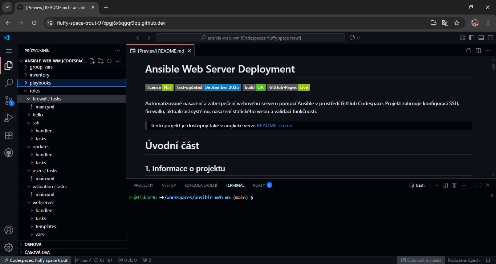

# Welcome to ansible-web-wm
This project demonstrates automated deployment and security of a web server using **Ansible**.

---
## What it includes
- Roles for NGINX, Fail2ban, firewall, SSH, and automatic updates
- Secure password storage using `ansible-vault`
- Provisioning script `provision.sh` for easy deployment

---
## Video presentation
Watch the full provisioning and deployment process:  
[Project presentation ansible-web-wm](https://www.youtube.com/watch?v=aNvzjHr_p9I&t=3s)

---
## Documentation
- [Czech version (README-cz.md)](README-cz.md)
- [English version (README-en.md)](README-en.md)

---
## Screenshots

  

## Author
Michaela Kučerová  
Version: 1.0  
Last updated: September 2025  
License: MIT
